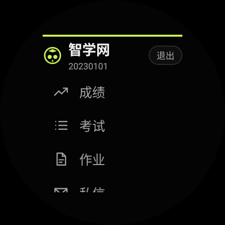
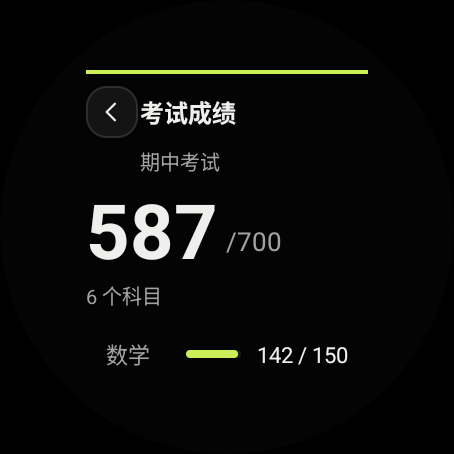
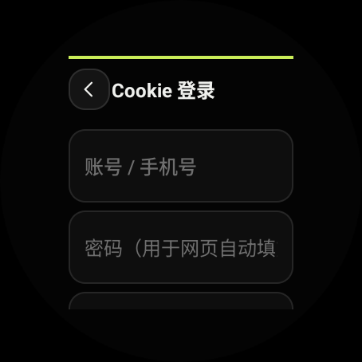

<div align="center">

# zhixue-wear · 智学网手表版

**非官方 · 开源 · Android / Wear OS 手表客户端**

把智学网装进手表：成绩、考试、作业、私信，一屏搞定。

[](LICENSE)
[](#环境要求)
[](#环境要求)
[](THIRD-PARTY-LICENSES.md)

  

</div>

---

## ⚠️ 免责声明

- 本项目为**非官方**客户端，与智学网官方**无任何关联**，未获其授权或认可。
- 「智学网」为相关权利人的商标。
- 本项目仅调用智学网**公开网页接口**，用于**个人学习、研究与自查**。
- 请遵守智学网用户协议，**不得**用于批量抓取、数据倒卖或骚扰他人。
- 使用本项目的风险由使用者自行承担。

---

## ✨ 特性

| 功能 | 说明 |
| :--- | :--- |
| 🔐 **网页登录 + 极验验证码** | 内置 WebView 打开官方登录页，人机验证由官方页面呈现，手指滑动/点选即可 |
| 🍪 **两种登录方式** | WebView 登录（推荐）/ 粘贴 Cookie（无 WebView 设备兜底） |
| 📊 **成绩** | 大字号总分 + 各科细进度条，数值滚动与进度条回弹动效 |
| 📝 **考试** | 考试列表 → 考试详情 → 错题本 |
| 📚 **作业 / 私信** | 作业列表、私信列表 |
| ⚡ **动效** | 强调线展开、错峰入场、数字滚动、进度条弹入、按压反馈、页面转场 |
| 📴 **离线容错** | 登录态失效自动跳登录页，不会卡死或只抛错误 |
| 🫲 **完整导航** | 左上角退出 / 返回，圆屏与方屏都适配 |

### 适配

- **方屏**（如 OWW211，378×496 px @320dpi ≈ **189dp × 248dp**）—— 实测通过
- **圆屏**（Wear OS 454×454 px / 227dp）—— 模拟器验证通过

> 画布极小是这块表最大的设计约束：宽度只有约 189dp。布局全部做了圆屏安全区处理（`BoxInsetLayout`）。

---

## 🚀 快速开始

### 环境要求

- **JDK 17+**（构建用）
- **Android SDK**：platform 34、build-tools 34+
- 运行设备：**Android 8.0（API 26）及以上**
- 手表需具备 **Android System WebView** 才能使用网页登录（没有则自动降级到 Cookie 登录）

### 构建

```bash
git clone https://github.com/Tuchoc0319/zhixue-wear.git
cd zhixue-wear

# 指向你的 Android SDK（二选一）
export ANDROID_HOME=/path/to/Android/Sdk
# 或者： cp local.properties.example local.properties && 编辑 sdk.dir

./build.sh :app:assembleDebug
# 或直接用 wrapper：
./gradlew :app:assembleDebug
```

产物：`app/build/outputs/apk/debug/app-debug.apk`

### 安装到手表

手表需先打开 **开发者选项 → ADB 调试**（Wear OS 可用「通过 WLAN 调试」）：

```bash
adb devices                      # 确认能看到手表
adb install -r app/build/outputs/apk/debug/app-debug.apk
```

安装后手表应用列表会出现「智学网」。

### 使用方法

1. 打开 App → 点「登录」
2. 若是首次，先在登录页输入账号密码；**完成后从「关于」页可进入账号设置预存账号密码**，下次自动填充
3. 点登录页的「登 录」→ **极验验证码会弹在手表屏幕上** → 用手指完成
4. 验证通过后自动保存登录态，返回主菜单

> 登录态失效时，App 会**自动清空会话并跳转登录页**，不会卡在报错页。

---

## 📁 项目结构

```
zhixue-wear/
├── app/src/main/
│   ├── java/com/zhixue/wear/
│   │   ├── MainActivity.java            主菜单
│   │   ├── LoginWebActivity.java        ★ 网页登录 + 极验验证码 + Cookie 回收
│   │   ├── CookieLoginActivity.java     粘贴 Cookie / 账号设置
│   │   ├── MarksActivity.java           成绩（大分数 + 进度条）
│   │   ├── ExamsActivity.java           考试列表
│   │   ├── ExamDetailActivity.java      考试详情 + 错题本
│   │   ├── HomeworkActivity.java        作业
│   │   ├── MessagesActivity.java        私信
│   │   ├── AboutActivity.java           关于 / 退出
│   │   ├── net/                         ZhixueApi / ZhixueClient / ZhixueService
│   │   ├── store/SessionStore.java      Cookie 持久化（含 OkHttp CookieJar）
│   │   └── ui/                          Anim / ScoreBar / ListActivityBase
│   └── res/                             布局 / 颜色 / 尺寸令牌 / 矢量图标
├── docs/
│   ├── api.md                           智学网接口整理（基于上游库）
│   └── ui-spec.md                       UI 需求与「UI ↔ 逻辑契约」交接文档
├── tools/check-ui-contract.py           UI 契约校验器（改布局后跑它）
└── build.sh                             一键构建
```

---

## 🔧 技术要点

### 1. 为什么登录必须用 WebView

逆向 `wap_login.html` 的 JS 后可以确认：

- 密码使用 **RC4 + 固定密钥** 加密后转 hex 提交；
- 验证码类型由 `sso.zhixue.com/sso_alpha/v1/getCaptchaType` 下发，实测为
  **`captchaType = "third"`（极验 Geetest）**；
- 极验带设备指纹与加密载荷，**无法在原生代码中复刻**，必须交给真实浏览器环境。

因此本项目用 WebView 承载官方登录页，人机验证由官方页面原生呈现 ——
这也正好满足「需要验证时弹出让用户操作」的体验。

> ⚠️ 登录页的 WebView **不能被任何浮层遮挡或拦截手势**，否则用户无法完成验证。

### 2. 一个容易踩的坑：`loginUserName` 不代表登录成功

登录页的 JS 在**点击「登录」的瞬间**就会写入一个客户端 Cookie：

```js
$.cookie("loginUserName", userName, { expires: 7, path: "/" });  // 只是"记住用户名"
```

它**不代表服务端登录成功**。如果拿它当成功判据，会出现
「刚点登录就被判定成功并关掉 WebView，用户根本看不到验证码」。

正确做法（`LoginWebActivity.verifySession()`）：拿到 Cookie 后再**双重校验**——

1. `/container/getCurrentUser` 返回非空 `role`；
2. `/container/app/token/getToken` 返回非空 `token`（后续所有请求都依赖 XToken）。

只看第 1 项不够：存在「服务端认角色但拿不到 XToken」的半失效会话。

### 3. 学生端鉴权（XToken）

```text
authguid      = uuid4()
authtimestamp = 毫秒时间戳
authtoken     = md5(authguid + authtimestamp + "iflytek!@#123student")
GET /container/app/token/getToken  →  result 即 XToken（缓存 600 秒）
```

### 4. 自动填充不要用 `focus()`

Android 系统自动填充只写 DOM 的 `value`，不触发页面 JS 监听的
`input/change/keyup`，会让页面内部模型为空、提交时报「密码不能为空」。
本项目在赋值后主动补发这些事件 —— 但**绝不调用 `el.focus()`**，
因为在 WebView 里对输入框 focus **会弹出软键盘**。

### 5. `layout_width` 不能只写在 `<style>` 里

在 `<style>` 中定义 `android:layout_width` / `layout_height`，inflate 阶段
**不会被采纳**，运行时会抛：

```
You must supply a layout_width attribute.
```

必须写在标签上。项目里 `tools/check-ui-contract.py` 可以帮忙卡住这类问题。

---

## ✅ 改 UI 请先跑契约校验

改布局前务必知道：**Java 侧用 `findViewById` 绑定了若干 view id**，
删掉或改名会导致 `NullPointerException` / `ClassCastException` 崩溃。

```bash
python tools/check-ui-contract.py .
```

它校验 4 件事：必需的 view id 是否齐全、Java 引用的 id 是否存在、
关键控件类型是否兼容、有无重复 id。**退出码 0 才算通过。**
详见 [`docs/ui-spec.md`](docs/ui-spec.md) 第 7 节「UI ↔ 逻辑契约」。

---

## 🙏 致谢与许可

本项目是**基于 [zhixuewang-python](https://github.com/anwenhu/zhixuewang-python) 开发的衍生作品**：

- 参考了其接口地址定义、学生端鉴权算法与数据模型设计
- Java 实现为**独立重写**，未直接复制其 Python 源码

上游项目采用 **MIT 许可证（Copyright (c) 2019 anwenhu）**。
依 MIT 条款，其版权与许可声明已**完整保留**在
[`THIRD-PARTY-LICENSES.md`](THIRD-PARTY-LICENSES.md)。

本项目同样以 **MIT 许可证**发布，详见 [`LICENSE`](LICENSE)。

---

## 🤝 贡献

欢迎 Issue 与 PR。提交前请确保：

1. `python tools/check-ui-contract.py .` 退出码为 0
2. `./gradlew :app:assembleDebug` 构建通过
3. 未引入任何真实账号、Cookie、手机号等个人隐私信息

---

<div align="center">
<sub>本项目仅供学习交流 · 请勿用于任何违反智学网用户协议的场景</sub>
</div>
